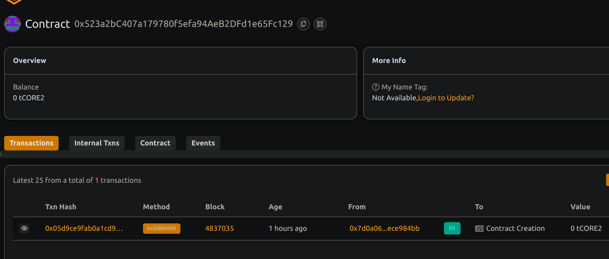

# Lending and Borrowing Platform with Collateral Handling
## Project Overview
This is a decentralized smart contract system that lets users borrow one type of cryptocurrency by locking up a different type as collateral. The collateral stays locked until the borrower fully repays the loan.

## Project Goal
To build a secure, trustless system where people can borrow crypto by pledging their own tokens—no need to trust or hand over control to any third party. The system ensures loans are always backed by enough collateral.

## Main Features
- Loans backed by crypto: Users deposit collateral to receive loans.
- Owner-set collateral ratio: The admin can decide how much collateral is required.
- Collateral release on repayment: Once the borrower repays the full amount, their collateral is unlocked.
- Automatic liquidation: If a loan becomes too risky (collateral value drops), the system can liquidate it.
- Admin token access: The admin can withdraw any unused tokens from the contract.

## Future Plans
- Live price updates: Use Chainlink oracles to get real-time token prices for accurate collateral checks.
- Interest system: Add interest to borrowed loans.
- Support multiple tokens: Let users use different tokens for both loans and collateral.
- User-friendly dashboard: Allow users to see loan status and risk level easily.

## Contract details
0x523a2bC407a179780f5efa94AeB2DFd1e65Fc129

THANKS
